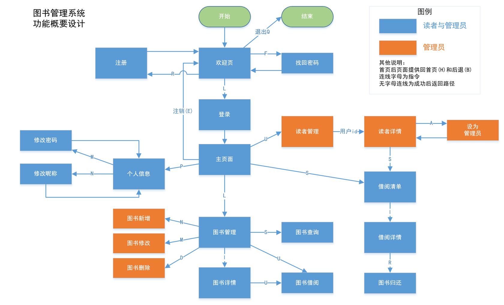

# MVC设计模式
- M层：
    - 用户信息模型：UserinfoModel
    - 图书模型：BookinfoModel
    - 借阅清单模型：BorrowregModel
  
- V层：
    - 添加图书页:BookAddPage
    - 图书清单页:BookListPage
    - 借阅清单页 :BorrowListPage
    - 个人主页:HomePage
    - 读者信息页:UserInfoPage
    - 登录页:LoginPage
    - 读者清单页:ReaderListPage
    - 注册页:RegsterPage
    - 各页面父业:SuperPage
    - 用户信息页:UserInfoPage
    - 欢迎页:WelcomePage
- C层：
    - 公共动作控制：PublicAction
    - 图书动作控制：BookAction
    - 用户动作控制：UserAction
- Api:
    - MD5加密：encrypt_password()
    - 获取日期：getToday()
    - 检查输入：accept_input()
    - 装饰器_检查是否管理员：@authcheck
    - 装饰器_检查是否已登陆：@logincheck